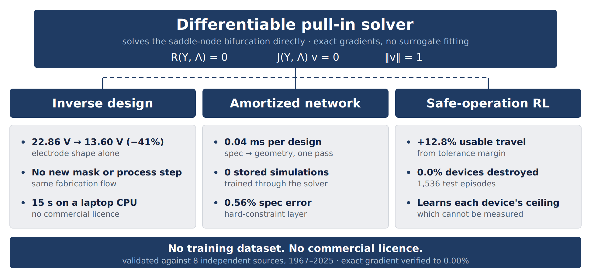

# Cutting MEMS Drive Voltage by 41% — Inverse Design Through the Pull-In Bifurcation



Electrostatic MEMS actuators are held back by two limits that share one cause.
Drive voltages are too high for a CMOS supply, so the device carries a charge
pump. And only a third of the gap is usable, because the exact snap threshold
moves with fabrication tolerance and **cannot be measured without destroying
the device** — so every die is driven for the worst case.

Both limits are pull-in. This repository attacks it directly.

| Device-level outcome | Result |
|---|---|
| **Drive voltage, same process and mask count** | **22.86 V → 13.60 V (−41%)**, electrode geometry only |
| **Usable travel recovered from tolerance margin** | **+12.8%**, at **0.0% of devices destroyed** |
| **Design turnaround** | **15 s** on a laptop CPU, no licence |
| **Per-design cost once trained** | **0.04 ms**, spec met to 0.56% |

The technical point that makes it work: pull-in **is** a saddle-node
bifurcation, where the tangent stiffness is singular and an ordinary
differentiable solver breaks down. So we solve the extended fold system

```
R(Y, Λ) = 0 ,   J(Y, Λ) v = 0 ,   vᵀv − 1 = 0
```

directly (Keller 1977; Seydel) and take **exact gradients through the
bifurcation itself**, rather than differentiating a forward solve or fitting a
surrogate to tens of thousands of archived simulations. No COMSOL, no ANSYS, no
MATLAB, and **no training dataset anywhere**.

## ▶ Run it yourself — click a badge below

**Click a badge to open that notebook in Google Colab, then choose
`Runtime → Run all`.** Nothing to install, no licence, no GPU, no dataset.

They answer two different questions — *how does this work* and *are the numbers
real* — and together take under seven minutes. Every figure in both is computed
while you watch; none of it is a recording, and the fold residual (~1e-8) is
printed beside each result so you can see it converged.

| Notebook | Launch | What's inside |
|---|:---:|---|
| **How the method works**<br>`method_deep_dive.ipynb`<br><sub>~3 min</sub> | <a href="https://colab.research.google.com/github/thetushardudeja1/mems-differentiable-pullin/blob/main/notebooks/method_deep_dive.ipynb"></a> | **Watch devices get designed.** Four electrodes shaped from scratch, each held to exactly 2.000 µm of travel. See the sensitivity map that says where to cut voltage — it peaks near the **clamp**, not the tip, which is the opposite of intuition. Then a network turns a bare specification into a finished device in **0.04 ms**, and a controller reads 512 devices' hidden failure limits without breaking one. |
| **Validation and results**<br>`MEMS_differentiable_pullin.ipynb`<br><sub>~4 min</sub> | <a href="https://colab.research.google.com/github/thetushardudeja1/mems-differentiable-pullin/blob/main/notebooks/MEMS_differentiable_pullin.ipynb"></a> | **Watch the claims get checked.** Eight published sources from 1967 to 2025 — two of them physically measured devices — verified in front of you, printing PASS as they go. The optimal exponent **reverses** between boundary conditions, straight out of the physics, which no surrogate fitted to data could tell you. Then **22.86 V → 14.04 V** of drive voltage comes off, live, with travel pinned at 2.0000 µm the whole way. |

<!-- Both badge URLs embed the repository path. If this is pushed under a
     different owner or name, update BOTH badge links above and REPO_URL in
     each notebook's setup cell, or the clone will fail in Colab. -->

### How the method works — [`method_deep_dive.ipynb`](notebooks/method_deep_dive.ipynb)

This is the one to open if you want to understand *why* the approach works. It
takes the four ideas the 3-page report had to compress into a paragraph each and
gives them room, computing every one of them in front of you:

| | |
|---|---|
| **The gradients are exact** | Euler's homogeneous-function theorem holds to **0.000000%** with no fitted constant, and one reverse pass replaces 120 finite-difference solves |
| **Where the leverage actually is** | sensitivity ∂V<sub>PI</sub>/∂D(ξ) peaks at **ξ = 0.217**, near the clamp — the free tip carries only **16.7%** of it, which is the opposite of where intuition puts it |
| **Reshaping the electrode** | four devices designed, solved and differentiated from scratch, each held to exactly 2.000 µm of travel so the comparison is fair |
| **Design without optimisation** | a specification goes in and a finished device comes out in **0.04 ms**; the differentiable hard-constraint layer drives specification error from 0.56% to **exactly zero** |
| **Adaptive control** | 512 devices with unmeasurable failure ceilings, evaluated in **0.8 s**, recovering headroom at **0.0% destroyed** |

**2 min 48 s** on an idle laptop CPU; allow a few minutes more on a free Colab
runtime. The fold residual (~1e-8) is printed beside every result, so you can
see each one is a converged solve rather than a fit.

*No interactive widgets.* An earlier version drove these figures with ipywidgets
sliders. They render in JupyterLab but not reliably in Colab, where the Output
widget fails to capture matplotlib
([colab-cdn-widget-manager#4](https://github.com/googlecolab/colab-cdn-widget-manager/issues/4)).
Plain figures work in every front-end.

### Validation and results — [`MEMS_differentiable_pullin.ipynb`](notebooks/MEMS_differentiable_pullin.ipynb)

This is the one to open if you want to check that the numbers are real. It runs
the validation suite and the headline experiments live, in **2 min 28 s** on a
laptop CPU and about **four minutes** on a free Colab runtime:

| § | What it computes, live | Result you should see |
|---|---|---|
| 2 | The fold, by displacement-controlled continuation | baseline **22.864 V**, residual ~1e-8 |
| 3 | The exact gradient, checked against Euler's identity | **0.000000%** error, no fitted constant |
| 4 | All five validation scripts against the eight sources | **ALL CHECKS PASSED** |
| 5 | The optimal-exponent sweep, both boundary conditions | the **reversal**, n\*≈4/3 → n\*=1 |
| 6 | Inverse design descending from the uniform gap | **22.86 → 14.04 V**, travel pinned at 2.0000 µm |
| 7 | The three long experiments | shown precomputed, with the command to reproduce each |

Outputs are stored in both files, so they also read correctly on GitHub without
being run. The three long experiments (amortized network 26 min, RL 10 min,
surrogate baselines 10 min) are **not** re-run here — the arrays are committed
and the exact command for each is given, since the full codebase is released for
scale-up.

---

## Table of contents

1. [The problem, in industry terms](#1-the-problem-in-industry-terms)
2. [Method](#2-method)
3. [Complete baseline comparison](#3-complete-baseline-comparison)
4. [Validation against eight sources](#4-validation-against-eight-sources)
5. [Ablations: what actually mattered](#5-ablations-what-actually-mattered)
6. [Results that went against us](#6-results-that-went-against-us)
7. [Repository map and quick start](#7-repository-map-and-quick-start)

---

## 1. The problem, in industry terms

An electrostatic actuator collapses when the electrostatic force gradient
overtakes the mechanical restoring gradient. Two consequences dominate product
design:

**Drive voltage.** A cantilever with a uniform gap needs 22.86 V for 2 µm of
stable travel. A 3.3 V logic supply cannot provide that, so the die carries a
charge pump — area, noise, and a reliability liability.

**Wasted travel.** Pull-in caps usable stroke at roughly a third of the gap, and
the exact threshold varies die-to-die with tolerance. Measuring it destroys the
device, so a fixed-gain controller must target the *worst-case* die on the
wafer. Every good device is driven far below what it could take.

Both are set by where the fold sits and how it moves. If the fold is
differentiable, both become optimisation problems rather than search problems.

---

## 2. Method

**The solver.** A 1-D Euler–Bernoulli beam with a shaped gap profile D(ξ),
fourth-order finite differences, Newton with displacement-controlled
continuation. Nondimensionalised so Λ ∝ V².

**The fold.** Under voltage control the equilibrium branch turns around at
pull-in and ∂Y/∂Λ → ∞. Under displacement control it is smooth and
single-valued through the fold. We solve the extended system above for
(Y, Λ, v) simultaneously, so the fold point is located as the *solution of an
equation* rather than as the maximum of a sampled curve.

**The gradient.** Because the fold system is a smooth root-finding problem, the
implicit function theorem gives ∂V<sub>PI</sub>/∂D(x) exactly, at every point
along the beam, from **one reverse pass**. Verified two ways:

- **Euler's homogeneous-function theorem.** With fringing off, Λ<sub>PI</sub> is
  homogeneous of degree 3 in the gap profile, so Σᵢ Dᵢ ∂Λ/∂Dᵢ = 3Λ must hold
  with no fitted constant. Measured error: **0.000000%**.
- **Against central differences.** They agree to **2.4e-5 relative** at the node
  that dominates the design, and the worst absolute disagreement anywhere is
  4.1e-5 V per unit gap. That residual is the finite-difference truncation
  error, not the autodiff — changing the step moves it, changing nothing else
  does.

**Why that matters for cost.** Finite differences need 2N solves for an N-node
sensitivity; autodiff needs **one reverse pass**. At N=60 that is 120 solves
against one, measured **18× faster** here — and the ratio grows with N, because
the reverse pass stays at one regardless.

**A non-obvious finding.** The sensitivity ∂V<sub>PI</sub>/∂D peaks at
**ξ = 0.217**, near the clamp, not at the tip where deflection is largest — the
tip carries only **16.7%** of the peak sensitivity. The electrode shaping that
buys drive voltage happens in the first quarter of the beam, which is the part
a designer is least likely to tune by hand.

Reproduce all of the above: `python sim/sensitivity_map.py` (~10 s).

---

## 3. Complete baseline comparison

This is the section the 3-page report could not fit. Every number traces to a
named script.

### 3.1 Versus a published hand-tuned study

Haluzan *et al.* (*Micromachines* 2010) scanned a family of shaped gap profiles
by hand. We re-solve their benchmark, both boundary conditions, every design
re-fitted to exactly 2 µm of stable travel on the same N=60 grid.

| Design | Cantilever, ours | Cantilever, paper | Fixed–fixed, ours | Fixed–fixed, paper |
|---|---|---|---|---|
| Uniform gap | 22.86 V | 23.66 V | 175.83 V | 178.26 V |
| Linear (n=1) | 14.31 V | 14.86 V | 123.01 V | 125.48 V |
| Best family in the paper | 13.61 V | 14.14 V | 121.79 V | 123.94 V |
| **Free-form (ours, 60 d.o.f.)** | **13.60 V** | — | **120.03 V** | — |
| Optimal exponent n\* | **1.29** | 4/3 | **1.00** | 1.00 |
| Gain over best family | 0.14% | — | 1.45% | — |

**Independently matched, never fitted:** d_max = 6.571 µm against their
published 6.57 µm; flattened-bottom ratio 0.80 against 0.78.

**The exponent reversal.** The optimal exponent moves from n\* ≈ 4/3 for a
cantilever to n\* = 1.00 for a fixed–fixed beam. This is the single strongest
piece of evidence here: a surrogate fitted to cantilever data has no way to know
the optimum moves when the boundary condition changes, because the reversal is a
property of the *equations*, not of the data. Reproducing it requires actually
solving them. Script: `gen_figdata.py:gen_f2()`.

**An open question, answered.** Haluzan *et al.* conjectured that further gains
beyond simple shapes "are believed to be minimal." Measured on their own
benchmark: **0.14%** (cantilever), **1.45%** (fixed–fixed). They were right, and
it is now quantified rather than believed.

**Positive controls.** Started from a uniform gap with no knowledge of the
published family, the optimiser descends 22.86 → 13.87 V (cantilever) and
175.8 → 123.5 V (fixed–fixed) unaided, converging on the published profile
*shape*. The result is not an artefact of a favourable initialisation.

### 3.2 Versus machine-learning surrogates, at equal budget

The fair question is not "is a surrogate bad" — it is "given the same number of
true solves, who ends up with the better device." Both surrogates were
strengthened until they stopped being strawmen: active learning, a trust region,
and feasible restarts.

| Method | Training samples | Design time | V<sub>PI</sub> |
|---|---|---|---|
| MLP surrogate + active learning | 400 | 71 s | 17.203 V |
| FNO surrogate + active learning | 400 | 594 s | 14.245 V |
| Direct differentiable (400 solves) | **0** | 15 s | 13.783 V |
| Direct, converged (4 restarts) | **0** | 170 s | 13.665 V |
| **Amortized network** | **0** | **0.04 ms** | **13.636 V** |
| **Network + 100 steps** | **0** | 17 s | **13.599 V** |

Scripts: `surrogate_fair.py`, `fno_surrogate.py`, `amortized_vs_converged.py`.

**The FNO is competitive and we say so.** 14.245 V is a respectable device, and
it contradicted our initial hypothesis that a fold point would be structurally
hard to interpolate — it even predicted its own optimum to 13.178 V against
13.162 V actual. Our advantage over it is **no training data, no architecture
search, and 40× less wall-clock**, not superior accuracy.

### 3.3 Versus the standard dataset-driven pipeline

Zhang *et al.*, *Microsyst. Nanoeng.* **11**:214 (2025) is the canonical modern
workflow: generate a large FEM dataset, fit an MLP, then inverse-design through
the surrogate. It is a **different task** (electrothermal linearisation, not
pull-in), so this compares *methodology* and never head-to-head performance.

| | Zhang *et al.* 2025 | This work |
|---|---|---|
| Simulations in dataset | **48,000** | **0** |
| Gradient source | fitted surrogate | **exact, through the fold** |
| Inference per design | 0.01 s | 0.04 ms |
| Cost to change the spec | retrain or re-fit | none — spec is a network input |
| Cost to change boundary condition | **regenerate the dataset** | change one argument |
| Commercial licence needed | FEA for data generation | **none** |

The last two rows are the practical argument. A dataset-fitted model is bound to
the design space its data covered. The exponent reversal in §3.1 is exactly the
kind of transfer that breaks it, and exactly the kind that costs nothing here.

### 3.4 Honest cost accounting

Table 3.2 mixes cost types, and it would be unfair to the surrogates to leave
that implicit. Separating one-time from per-design cost:

| Method | One-time cost | Per-design cost | Data |
|---|---|---|---|
| MLP surrogate | 71 s (incl. sampling) | ~0 (inference) | 400 solves |
| FNO surrogate | 594 s (incl. sampling) | ~0 (inference) | 400 solves |
| Direct differentiable | **none** | 15 s | **none** |
| Amortized network | 1,577 s / 6,000 **live** solves | **0.04 ms** | **0 stored** |

The amortized network's training cost is real and larger than the surrogates'.
What it buys is a per-design cost of 0.04 ms **with zero stored samples**, and a
network whose input is the specification — so sweeping the spec is free rather
than a new optimisation each time.

**How 0.04 ms is measured.** The network is two small MLP passes, so Python and
JAX dispatch overhead dominates a single call and the per-design figure depends
on batching. Measured on CPU: 0.023 ms/design at batch 64, 0.009 ms at 256,
0.004 ms at 4096, and sub-millisecond one-at-a-time. **0.04 ms is the batched
figure**, which is the realistic regime for the use it is built for — spec
sweeps and yield studies over many devices.

### 3.5 Versus classical control, under unmeasurable variance

In a 2-DOF actuator the beam can tip in before snapping down, at an angle set by
a fabrication parameter β that is **not observable at test time**. A fixed-gain
controller must therefore target the worst-case device.

| Policy | Mean travel | Devices destroyed |
|---|---|---|
| Best safe fixed target | 0.5674 | 0.0% |
| **Adaptive RL policy** | **0.6399 ± 0.0044** | **0.0 ± 0.0%** |
| Oracle (knows the ceiling) | 0.6577 | 0.0% |

**80.4 ± 4.9% of available headroom recovered**, i.e. **+12.8% usable travel**,
across 3 seeds × 512 held-out devices, with **zero devices destroyed**.

**The decisive test is not the mean.** A policy that had merely become less
conservative would raise mean travel and leave the correlation near zero. What
matters is whether achieved travel tracks *each individual device's own*
ceiling:

| | correlation ρ(travel, ceiling) |
|---|---|
| Adaptive policy | **+0.99** |
| Fixed gain | +0.06 |

The policy beats the fixed baseline in **every** ceiling bin, including the most
fragile. That is inference of an unmeasurable parameter from the transient
response, not reduced caution. Script: `analyze_rl2dof.py`, logged in
[`sim/run_final.log`](sim/run_final.log).

Measured across 3 seeds × 2000 iterations × 4096 environments, on a fixed
held-out set of 512 devices. Reproduce with `python analyze_rl2dof.py 3`
(~8 min on a GPU).

The checkpoint bundled for the notebook demo (`sim/rl_policy.pkl`) is a shorter
single-seed run, so it loads and evaluates in under a second in Colab; it
recovers 65.8% of headroom on the same held-out set.

---

## 4. Validation against eight sources

Spanning 1967–2025, including two **measured** devices.

| # | Source | Quantity | Ours | Reference | Error | Script |
|---|---|---|---|---|---|---|
| 1 | Flores 2016; Gomez 2017 | λ\* lumped | 0.148150 | 4/27 = 0.148148 | **0.001%** | `pullin.py` |
| 2 | Standard | Λ_PI cantilever | 1.6799 | 1.6790 | **0.05%** | `test_fold.py` |
| 3 | Standard | Λ_PI fixed–fixed | 69.935 | 71.167 | 1.73% | `test_fold.py` |
| 4 | Analytic `c³` law | Σ ∂Λ/∂D | 5.0398 | 5.0398 | **0.00%** | `test_fold.py` |
| 5 | Seeger & Boser 2003 | tip-in, design #1 | 19.0% | 19% | **exact** | `model2dof.py` |
| 6 | Seeger & Boser 2003 | tip-in, design #3 | 85.1% | 85% | **0.12%** | `model2dof.py` |
| 7 | Seeger & Boser 2003 | instability mechanism | **3/3 correct** | — | — | `model2dof.py` |
| 8 | Nazemi 2025 (**measured**) | V_PI reduction | 13.2% | 16.0% | 2.8 pp | `validate_nazemi.py` |
| 9 | M-TEST 1997 (**measured**) | V_PI, 500 µm beam | 11.70 V | 11.1 ± 0.1 V | +5.4% | `validate_mtest.py` |

**The discriminating test.** Designs #3 and #4 of Seeger & Boser are
mechanically identical and differ only in parasitic capacitance. The model
correctly predicts that this single *electrical* change flips the failure mode
from tip-in to charge pull-in and costs 20% of travel. That is a mechanism
prediction, not a fitted number.

---

## 5. Ablations: what actually mattered

| Change | Effect | Why it matters |
|---|---|---|
| Soft constraint penalty → **differentiable hard-constraint layer** | spec error ~5% → **0.56% mean / 2.14% worst** | A penalty biases the design and never quite meets spec; a hard layer imposes it while still passing correct gradients |
| Feed-forward → **+ enforcement layer at inference** | spec error 0.56% → **exactly 0**, cost 0.04 ms → ~200 ms | The two modes are a genuine speed/exactness dial |
| Cold start → **warm start from the network** | reaches a better design in **5 steps** than a cold start does in **500** | This, not raw accuracy, is where amortisation actually pays |
| fp32 → **fp64** | residual **2.0 → 1e-8** | The 4th-order stencil is cancellation-limited; fp32 does not converge at all |
| N=40 → N=60 grid | flipped the sign of a conclusion once | Every headline number here is at N=60; grids are never mixed silently |

---

## 6. Results that went against us

Stated because a result that only reports its wins is not a result.

* **The amortized network matches converged optimisation, it does not beat it.**
  13.636 V vs 13.665 V is inside the 0.28% spread across optimiser restarts. The
  genuine win is cost: 0.04 ms and zero training data.
* **A well-built FNO surrogate is competitive** (14.245 V at equal budget),
  contradicting our initial hypothesis that a fold point would be structurally
  hard to interpolate.
* **Absolute voltages carry a systematic offset.** M-TEST is +5.4% high ([010]
  modulus) and the uncertainty intervals do not overlap the measurement; the
  Nazemi microbridge is ~+85% high in absolute terms. Evidence points to
  **anchor compliance** (an effective length of ~162 µm against a drawn 120 µm),
  which our ideal-clamp 1D model does not represent. Relative and trend
  predictions — which is what the design claims rest on — agree to within 2.8
  percentage points.
* **No GPU speed-up for the static solver.** It requires float64 and consumer
  GPUs run fp64 at ~1/64 rate, so this workload is CPU-bound by design
  (1,430 designs/s batched). GPU *is* used for the fp32 dynamics and RL training.
* **Fixed–fixed designs with exponent n ≳ 1.8 are infeasible**, not merely
  high-voltage: travel saturates below the 2 µm specification at any scale. They
  are excluded from the sweeps rather than plotted.
* **An earlier reported "106% of headroom recovered"** was an artefact of a
  mislabelled oracle and a handicapped baseline; corrected to the 80.4% above.

---

## 7. Repository map and quick start

```bash
conda env create -f environment.yml
conda activate mems
cd sim

jupyter lab ../notebooks/MEMS_differentiable_pullin.ipynb   # ~4 min, CPU only

python test_fold.py          # solver + exact-gradient validation
python validate_beam.py      # distributed beam vs. literature
python model2dof.py          # 2-DOF tip-in vs. Seeger & Boser
python validate_nazemi.py    # vs. a 2025 measured microbridge
python validate_mtest.py     # vs. a 1997 measured pull-in voltage
```

Reproduce every figure from saved arrays (no experiment re-run):

```bash
python gen_figdata.py && python gen_figdata2.py
python make_figures.py && python make_tables.py && python make_arch.py
```

The long experiments, with runtimes:

```bash
python amortized_hard.py          # train the design network   ~26 min
python analyze_rl2dof.py 3        # 3 RL seeds, full scale     ~8 min
python surrogate_fair.py          # MLP / FNO baselines        ~10 min
python inverse_design.py          # free-form design, both BCs ~15 min
```

| File | Purpose |
|---|---|
| `sim/beam.py` | Distributed beam solver; fold system; exact gradients |
| `sim/sensitivity_map.py` | Where the beam is most sensitive; autodiff vs. differences |
| `sim/pullin.py` | Lumped dynamic model (GPU-batched) |
| `sim/inverse_design.py` | Gradient-based gap-profile design, both BCs |
| `sim/amortized_hard.py` | Amortized design net + hard-constraint layer |
| `sim/env2dof.py`, `train_rl2dof.py` | 2-DOF RL environment and policy |
| `sim/analyze_rl2dof.py` | 3-seed RL evaluation; writes `figdata_rl3.npz` |
| `sim/surrogate_fair.py`, `fno_surrogate.py` | MLP / FNO surrogate baselines |
| `sim/model2dof.py` | Classical charge-control baseline |
| `notebooks/method_deep_dive.ipynb` | How the method works: exact gradients, sensitivity, amortized design, adaptive control |
| `notebooks/MEMS_differentiable_pullin.ipynb` | Validation and results: eight published sources, the reversal, inverse design |
| `sim/make_arch.py` | System architecture diagram (Fig. 0) |
| `papers/README.md` | Reference library index (what each paper is used for) |
| `submission/` | ISMC 2026 deliverables |

**Environment.** Python 3.11, JAX 0.10.2, NumPy, Matplotlib; pinned in
`environment.yml`. Developed on WSL2 (Ubuntu) with an RTX 4060.

**Determinism.** All stochastic components use explicit, seeded JAX PRNG keys.
RL results are reported across 3 independent seeds with standard deviations, on
a fixed held-out set of 512 devices.

**Licence.** MIT — see [LICENSE](LICENSE). Use it for anything, including commercially; just keep the copyright notice.

## References

Reference library and per-paper usage notes: [`papers/README.md`](papers/README.md).
Primary benchmarks: Osterberg & Senturia (M-TEST, *JMEMS* 1997);
Haluzan *et al.* (*Micromachines* 2010); Seeger & Boser (*JMEMS* 2003);
Nazemi *et al.* (*J. Sens. Sens. Syst.* 2025); Zhang *et al.*
(*Microsyst. Nanoeng.* 2025); Flores (2016) and Gomez, Moulton & Vella (2017).
Third-party PDFs are **not** redistributed; the index gives full citations and DOIs.
